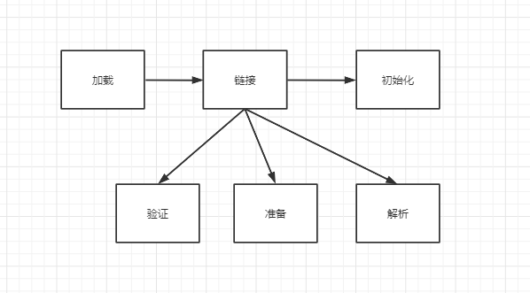

##### 类加载过程
系统加载 Class 类型的文件主要三步:加载->连接->初始化。连接过程又可分为三步:验证->准备->解析。

类加载过程的第一步，主要完成下面3件事情：
通过全类名获取定义此类的二进制字节流
将字节流所代表的静态存储结构转换为方法区的运行时数据结构
在内存中生成一个代表该类的 Class 对象,作为方法区这些数据的访问入口

准备阶段是正式为类变量分配内存并设置类变量初始值的阶段，这些内存都将在方法区中分配。
这时候进行内存分配的仅包括类变量（static），而不包括实例变量，实例变量会在对象实例化时随着对象一块分配在 Java 堆中。
这里所设置的初始值"通常情况"下是数据类型默认的零值（如0、0L、null、false等）

解析阶段是虚拟机将常量池内的符号引用替换为直接引用的过程。解析动作主要针对类或接口、字段、类方法、接口方法、方法类型、方法句柄和调用限定符7类符号引用进行。

初始化是类加载的最后一步，也是真正执行类中定义的 Java 程序代码(字节码)，初始化阶段是执行类构造器 <clinit> ()方法的过程。
对于<clinit>（） 方法的调用，虚拟机会自己确保其在多线程环境中的安全性。因为 <clinit>（） 方法是带锁线程安全，所以在多线程环境下进行类初始化的话可能会引起死锁，并且这种死锁很难被发现。

对于初始化阶段，虚拟机严格规范了有且只有5种情况下，必须对类进行初始化：
1、当遇到 new 、 getstatic、putstatic或invokestatic 这4条直接码指令时，比如 new 一个类，读取一个静态字段(未被 final 修饰)、或调用一个类的静态方法时。
2、使用 java.lang.reflect 包的方法对类进行反射调用时 ，如果类没初始化，需要触发其初始化。
3、初始化一个类，如果其父类还未初始化，则先触发该父类的初始化。
4、当虚拟机启动时，用户需要定义一个要执行的主类 (包含 main 方法的那个类)，虚拟机会先初始化这个类。
5、当使用 JDK1.7 的动态类型语言时，如果一个 MethodHandle 实例的最后解析结构为 REF_getStatic、REF_putStatic、REF_invokeStatic、的方法句柄，并且这个句柄没有初始化，则需要先触发器初始化。